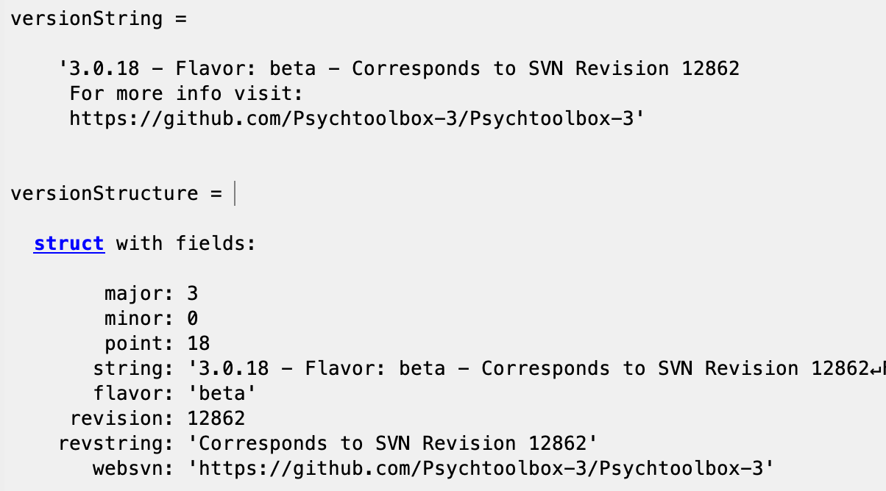

# Hidden Zeros (HZ)

HZ explores intertemporal choice, which is when people make decisions between something less now versus something more later (in this case, money now versus money later). We also call this smaller-sooner (SS) versus larger-later (LL). For example, the following trial is a choice between receiving $35 in 28 days versus receiving $24 today:

The main source of variation here is whether or not the $0's are displayed to the participants (hence the name). We run each possible variation:

- hide the zero on the LL options (the left side in the example)
- hide the zero on the SS options (the right side in the example)
- hide both zeros
- hide neither zero

Additionally, we vary which box the LL amount appears in: the left, middle, or right box.

We ran one study online with Qualtrics/MTurk, and another is currently being run through MATLAB.

## Software/Apps

### Qualtrics

Access Qualtrics through the [Booth Intranet](https://intranet.chicagobooth.edu/secure/staff.aspx). You probably won't need to do anything with this survey, but if you do, ask Steph to share with you.

### MATLAB

MATLAB installation should be straightforward. To install Psychtoolbox, follow the instructions [here](http://psychtoolbox.org/download.html). These experiments will run locally. My version of MATLAB is MATLAB R2021b, and my PTB version is below.

Psychtoolbox is a MATLAB package that allows you to run experiments by altering visual elements on the screen. It may take a bit to get used to, but there is lots of helpful documentation on the same site linked above, and you will have plenty of example code which should cover the basics of most experiments that Steph wants to run.

## Current Status

Initially, we ran this study on Qualtrics using participants from MTurk. Now we want eyetracking data as well to see where people are paying attention, so we're currently running an eyetracking study in MATLAB in the campus [Behavioral Lab](https://www.chicagobooth.edu/research/roman/what-we-do/research-labs/campus-lab) (on the bottom floor of Harper).

## Folders & Files

### Experimental Pics

Screenshots from both the online and in-person experiments.

### Experimental Instructions

Instructions for the online and in-person experiments.

### MATLAB Code (current)

This is what's currently being run in the lab. None of the files in here are organized because that's how the code currently calls them.

### MATLAB Code (old)

Previous version of the MATLAB code.

### Instructions for Lab RAs

Instructions for the RAs in the behavioral lab who actually run participants. You guys should probably also learn how to use the eyetracker, so these will be helpful to you too. Steph will likely train you at some point.

## Date

Last updated July 3, 2024.